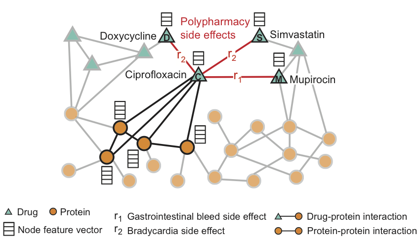

# Project of drug interactions

Contributors:
* Ngo Nhat Khang
* Hy Truong Son (Correspondent / PI)

Papers:
* Predicting Drug-Drug Interactions using Deep Generative Models on Graphs, NeurIPS 2022 (AI for Science) https://arxiv.org/pdf/2209.09941.pdf



Figure taken from http://snap.stanford.edu/decagon/

## Requirements
- [Pytorch](https://pytorch.org/)
- [Pytorch Geometric](https://pytorch-geometric.readthedocs.io/en/latest/)\
Recommend using Conda for easy installation. 
## Data
Make sure a Data folder is created in each data's subfolder. Then, you should donwload data from the links below and locate them into the Data folders as:
  ```
    ├── Anticancer                
    │   ├── Data
    │   ├── ...
    └── Polypharmacy                
    │   ├── Data  
    │   ├── ...
    └── README.md
   ```
#### Anticancer
Download from [ADRML](https://github.com/fahmadimoughari/AdrML)
#### Polypharmacy 
Download from [Decagon](https://github.com/mims-harvard/decagon)

## Run
#### Anticancer
  ```bash
    cd Anticancer/
    bash train.sh
  ```
#### Polypharmacy
- Train GAE
  ```bash
    cd Polypharmacy/
    python3 train_hetero_gae.py --seed 1 --num_epoch 300 --lr 1e-3 --chkpt_dir ./ --dropout 0.1 --device cuda:0
  ```
- Train VGAE
  ```bash
    cd Polypharmacy/
    python3 train_hetero_vgae.py --seed 1 --num_epoch 300 --lr 1e-3 --chkpt_dir ./ --dropout 0.1 --device cuda:0 --latent_encoder_type linear
  ```
- Train VGAE + Morgan fingerprints
  ```bash
    cd Polypharmacy/
    python3 train_hetero_vgae_morgan.py --seed 1 --num_epoch 300 --lr 1e-3 --chkpt_dir ./ --dropout 0.1 --device cuda:0 --latent_encoder_type linear
  ```
## Citations
```bibtex
@article{Zitnik2018,
  title={Modeling polypharmacy side effects with graph convolutional networks},
  author={Zitnik, Marinka and Agrawal, Monica and Leskovec, Jure},
  journal={Bioinformatics},
  volume={34},
  number={13},
  pages={457–466},
  year={2018}
}

```
```bibtex
@article{ahmadi2020adrml,
  title={ADRML: anticancer drug response prediction using manifold learning},
  author={Ahmadi Moughari, Fatemeh and Eslahchi, Changiz},
  journal={Scientific reports},
  volume={10},
  number={1},
  pages={1--18},
  year={2020},
  publisher={Nature Publishing Group}
}
```

